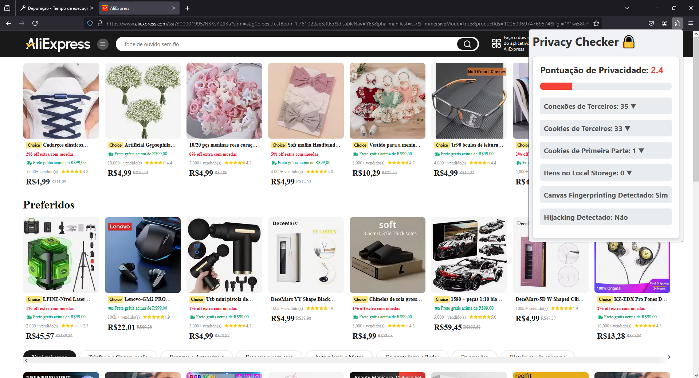

# Privacy Checker 🔒

## Descrição

**Privacy Checker** é uma extensão para o Mozilla Firefox que analisa páginas web quanto à privacidade do usuário. Ela monitora e avalia diversas atividades que podem impactar a privacidade, fornecendo uma pontuação estimada, a fim de fornecer um panorama mais claro sobre a segurança e privacidade da página web que está sendo visitada.

## Funcionalidades

### 1. Monitoramento de Conexões de Terceiros

A extensão detecta e lista todas as conexões de terceiros feitas pela página web, ajudando o usuário a entender quais domínios estão sendo acessados além do domínio principal.

### 2. Detecção de Hijacking

A extensão monitora tentativas de hijacking, como a substituição da função `alert` do JavaScript, e alerta o usuário caso alguma tentativa seja detectada.

### 3. Detecção de Canvas Fingerprinting

A extensão detecta tentativas de canvas fingerprinting, uma técnica usada para rastrear usuários através da renderização de gráficos em um elemento `<canvas>`.

### 4. Monitoramento de Cookies

A extensão monitora e categoriza cookies de primeira e terceira parte, incluindo cookies de sessão e persistentes, fornecendo uma visão detalhada sobre o uso de cookies pela página web.

### 5. Monitoramento de Local Storage

A extensão lista os itens armazenados no `localStorage` da página web, ajudando o usuário a entender quais dados estão sendo armazenados localmente pelo site.

## Arquivos Principais

- **background.js**: script de fundo que gerencia a coleta e armazenamento de dados de privacidade.
- **manifest.json**: arquivo de manifesto que define as permissões e scripts utilizados pela extensão.
- **popup.js**: script que gerencia a interface do popup da extensão.
- **popup.html**: estrutura HTML do popup da extensão.
- **content_script.js**: script injetado nas páginas web para monitorar atividades que impactam a privacidade.

## Sistema de pontuação

A extensão atribui uma pontuação de privacidade à página web com base em critérios específicos. Ela é calculada com base nas informações abaixo, dado que o máximo de pontos que uma página pode ter é 10.0, isto é, quando a página não apresenta nenhum risco à privacidade do usuário, e o mínimo é 0.0, quando a página é considerada extremamente invasiva.

| Critério                      | Dedução de Pontos |
|-------------------------------|-------------------|
| Conexões de Terceiros         | 0.1 por conexão   | 
| Hijacking Detectado           | 2.0               | 
| Canvas Fingerprinting Detectado| 1.5               | 
| Uso de Local Storage          | 0.1 por item      | 
| Cookies de Terceiros          | 0.1               | 

## Como a ferramenta é exibida

